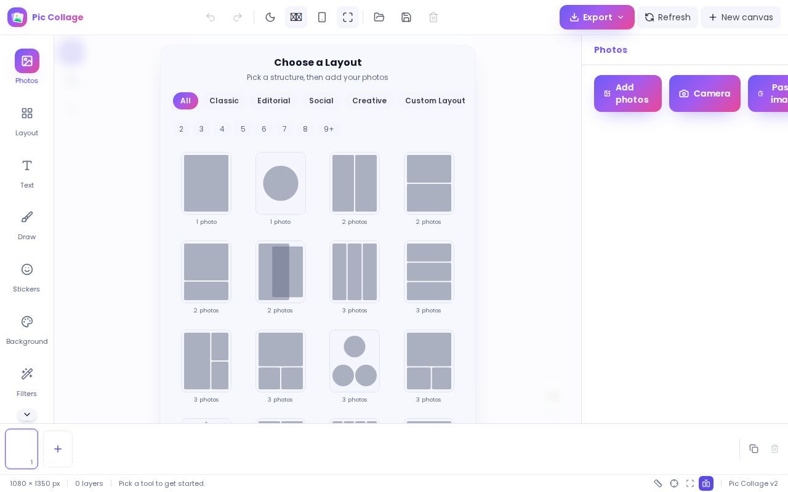
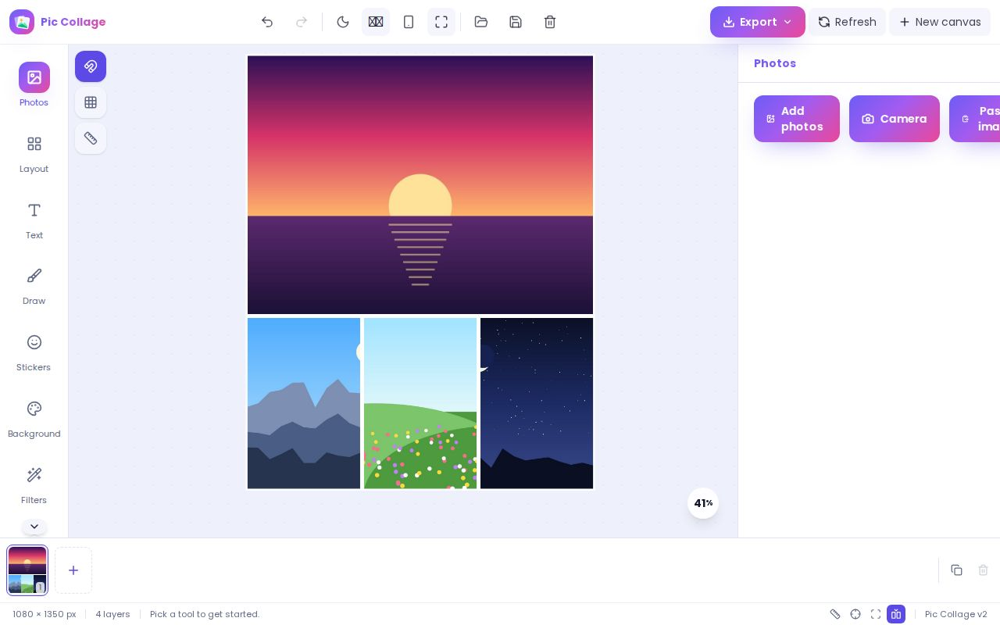
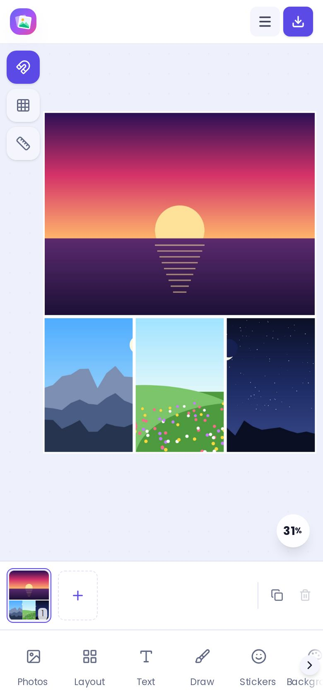
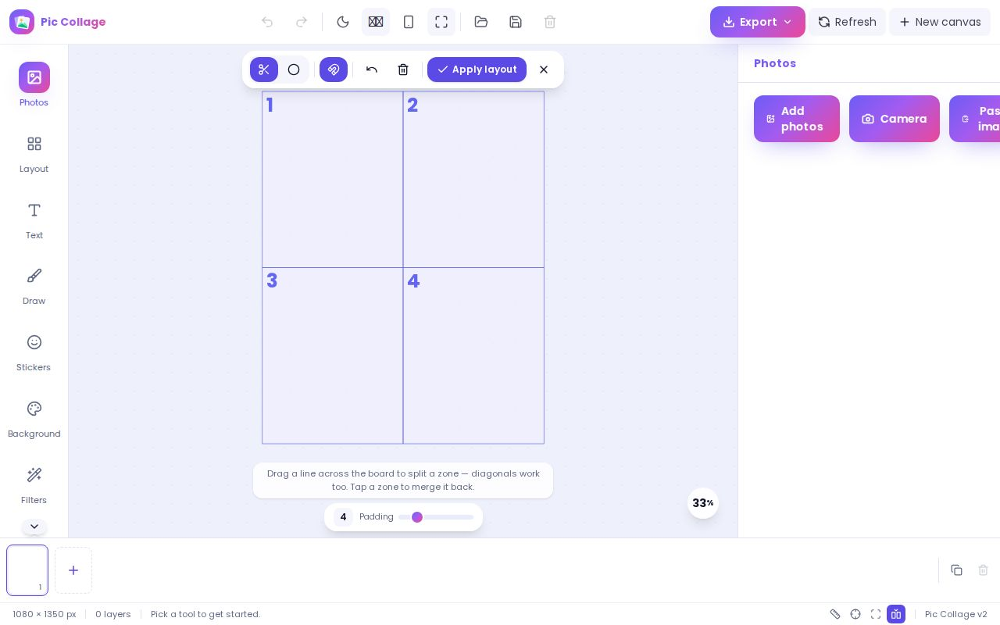
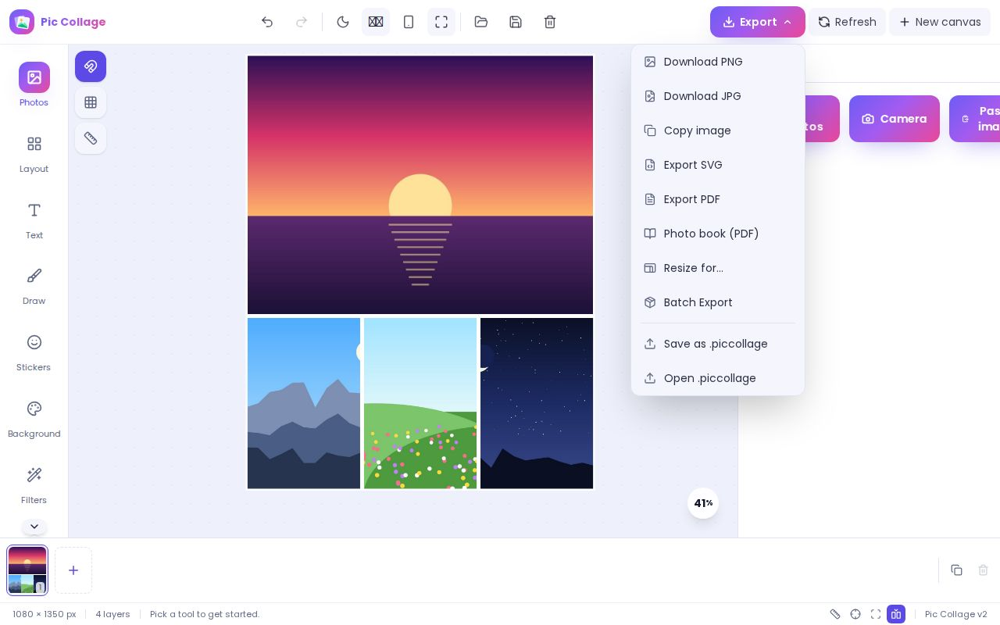

# Pic Collage Maker — User Guide

Pic Collage Maker is a photo collage editor that runs entirely in your browser.
Your photos never leave your device. The interface is available in six
languages: German, English, Spanish, French, Italian and Portuguese.

Questions? See the [FAQ](faq.md).

## Getting started

When you open the app with an empty board, you see **Choose a Layout**.

From here you can:

- pick a layout. Filter by category (Classic, Editorial, Social, Creative, plus
  Recent once you have used one) or by number of photos.
- choose **Custom Layout** to draw your own (see [Layouts](#layouts)).
- choose **Skip — Free Mode** to start with an empty free canvas.
- open **Canvas size** or **Templates** to start from a board size or a
  ready-made template.
- tap **Try with sample photos** to load four sample pictures into a layout, so
  you can try the editor before using your own photos.

### Install the app

You can install Pic Collage Maker so it opens full screen and works offline.

- **iPhone / iPad (Safari):** tap Share, then **Add to Home Screen**, then
  **Add**.
- **Android (Chrome):** open the browser menu and tap **Install app**.
- **Desktop:** when your browser supports installing, an **Install app** button
  appears in the header.

Once installed, you can open `.piccollage` files and images with the app from
your system (on browsers that support file handling).

On a phone, the panels open as sheets from the tab bar at the bottom, and the
header's **Menu** button holds undo/redo, language, projects, save and every
export option.

## Photos and import

Open the **Photos** tab:

- **Add photos** opens your gallery or file picker. You can select several
  photos at once.
- **Camera** takes a photo directly.
- **Paste image** pastes an image from the clipboard. **Ctrl+V** / **⌘V** works
  too.

JPEG, PNG, WebP, GIF, AVIF and HEIC/HEIF files are accepted. HEIC photos only
import in browsers that can decode them (Safari does); otherwise they are
skipped with a message. Files that aren't images are ignored.

When a layout needs photos, the **Add Photos** sheet lets you tap a slot to fill
it, use **Auto-fill from Gallery**, or **Skip for now**.

## Layouts

Open the **Layout** tab.

- **Canvas format:** Square, Portrait, Story, Landscape, Pin, Wide or Custom
  (enter width and height).
- **Templates:** ready-made designs grouped by Occasions, Travel, Social media
  and Print. **Save as my template** stores the current design under **Mine**.
- **Grid layouts:** 78 layouts for 1 to 16 photos, plus **Free** (no grid).
- **Grid style** (when a grid is active): Gutter, Corner radius and Margin.
  **Smart fill** (2 or more photos) places photos so faces stay in frame.
- **Photo shape:** clip photos to a shape (rectangle, circle, star, heart, arch,
  diamond, cloud, hexagon, triangle). **Apply to all photos** applies it to
  every photo.

In a grid, tap a cell to select its photo. Drag inside the cell to move the
photo, pinch (or use **Zoom photo in / out** in the selection bar) to zoom it,
and double-tap the cell to reset its position.

### Custom layouts

Choose **Custom Layout** on the start screen to draw your own grid.

- Drag a line across the board to split a zone. Diagonal lines work too.
- Tap a zone to merge it back.
- The toolbar has **Cut line** and **Round zone** tools (a round zone can sit
  **On top** of the others), a snap toggle, **Undo last**, **Clear all**,
  **Apply layout** and **Cancel**. **Padding** sets the gap between zones.

## Free canvas and gestures

In free mode, every element can be moved, resized and rotated with the handles
around it.

| Gesture                                    | What it does                                                                   |
| ------------------------------------------ | ------------------------------------------------------------------------------ |
| Mouse wheel                                | Zoom the canvas                                                                |
| Two-finger pinch on the canvas             | Zoom the canvas                                                                |
| Two fingers on a selected element          | Move, scale and rotate it in one step. Rotation snaps to 15° steps when close. |
| Pinch on a selected grid photo             | Zoom the photo inside its cell                                                 |
| Drag on an empty part of the board (mouse) | Rubber-band selection                                                          |
| Shift + click                              | Add or remove an element from the selection                                    |
| Shift while dragging                       | Turn snapping guides off for this drag                                         |
| Double-tap text                            | Edit the text in place                                                         |

The buttons beside the board toggle **Snap to guides** and show the grid and
rulers.

When something is selected, the **selection bar** offers: Duplicate, Send
backward, Bring forward, copy/paste style, Align (also **To board**), Group
(when several elements are selected), Opacity, Blend mode and Delete. For
photos it adds **Smart Crop**, **Remove BG**, **Retouch** and **Enhance**.

Selecting a photo also gives you **Crop** (aspect ratio or Free, Straighten,
Flip horizontal/vertical). In free mode, **Photo style** adds a border, rounded
corners, a shadow or a Polaroid frame.

The **Layers** tab lists every element. You can show/hide, lock, rename, drag to
reorder, and group or ungroup.

## Text, stickers, shapes and drawing

- **Text:** tap **＋ Add text**, then set content, color, size, alignment, line
  height and letter spacing. Choose a font from the font pack or upload your own
  (.ttf, .otf, .woff, .woff2). **Effects** adds Curve, Shadow, Label (a
  background chip) and Outline. **Suggest a caption** proposes captions based on
  your photo.
- **Stickers:** emoji in categories, plus a shape library (Arrows, Badges,
  Speech bubbles, Decorations).
- **Shapes:** the Layout tab adds a Rectangle, Circle, Triangle, Star or Arrow
  in the chosen **Default fill**.
- **Draw:** pick a brush color and size and draw freehand on the board. Switch
  to another tab to stop drawing.

## Filters and AI tools

Select a photo and open the **Filters** tab.

- **Presets:** Original, Vivid, Punch, Warm, Cool, Fade, Sepia, Noir, B&W.
- **Sliders:** brightness, contrast, saturation, hue, exposure, temperature,
  tint, shadows, highlights, blur and vignette.
- **Adjust:** Levels, Curves, Color mix, and LUT import (.cube files). Press and
  hold **Hold to compare** to see the original.
- **Styles:** Oil, Sketch and Pop Art.
- **Auto-Enhance** fixes exposure and contrast in one tap.
- **Reset all filters** returns the photo to its original look.

The AI tools — Auto-Enhance, Remove BG, Retouch, Smart Crop and caption
suggestions — run on your device. No photo is uploaded and no model is
downloaded.

## Backgrounds

Open the **Background** tab:

- **Solid:** one color.
- **Gradient:** From and To colors and an Angle.
- **Pattern:** dots, stripes, grid, checker or hearts, with a Motif color.
- **Photo:** use a photo as the background. **Remove photo** removes it.
- **Frame:** None, Solid, Rounded or Polaroid, with color and width.

## Pages

A project can hold several pages (montages). The page strip under the canvas
shows them.

- Tap **＋** to add a page. Adding or duplicating a page saves your work as a
  project if it isn't one yet.
- Tap a page to switch to it. Drag pages to reorder them.
- Use the buttons on the right of the strip to duplicate or delete the current
  page. After deleting, the toast offers **Undo**.

## Projects, autosave and history

- **Autosave:** the board is saved in your browser and restored when you come
  back. Once your work is a named project, it is saved automatically after you
  stop editing. **Settings → Autosave after** sets the delay (1.5, 5, 15 or 30
  seconds; 1.5 s by default).
- **Projects:** the folder button in the header opens your saved projects:
  open, rename, duplicate or delete them. After deleting, the toast offers
  **Undo**. **Save** saves the open project, or asks you to name a new one.
- **History tab:** **Steps** lists your recent edits; tap one to jump back.
  **Version History** keeps up to 20 snapshots of an open project's current
  page; you can **Restore** or **Delete** them.
- **New / clear** (trash icon) clears the board after asking.
- **`.piccollage` files:** **Export ▾ → Save as .piccollage** packs your
  collage and its photos into one file you can keep or move to another device.
  **Open .piccollage** loads one. In browsers that support it, the app
  remembers the file, and the menu then offers **Save to _file name_** and
  **Save as new file…**.

  > A `.piccollage` file currently holds only the page you are looking at.

## Export

The **Export ▾** menu (on a phone: **Menu**) offers:

- **Share…** — send JPEG images through your device's share sheet (only shown
  when your browser supports sharing).
- **Download PNG** / **Download JPG** — one image per page, at twice the board
  size (a 1080 × 1350 board gives a 2160 × 2700 image).
- **Copy image** — copy the board to the clipboard (where supported).
- **Export SVG** — the current page as an SVG file.
- **Export PDF** — the current page as a PDF.
- **Photo book (PDF)** — every page rendered at 300 DPI and fitted onto a
  sheet: Square 21 × 21 cm, A4 portrait or A4 landscape. Options: **First page
  is the cover** and **Page numbers**. **Create book** saves a PDF; **Print**
  opens the print dialog.
- **Slideshow video** — every page in turn, 2, 3 or 5 seconds each, with an
  optional crossfade and an optional song from your device (it loops to fill
  the video and fades out at the end). The video is 1080 pixels on its long
  side, saved as MP4 where your browser can record it and WebM otherwise. It is
  recorded in real time, so it takes as long to make as it lasts; keep the tab
  open. Only shown in browsers that can record video.
- **Share this page only** / **Download this page (PNG)** — shown when the
  project has more than one page.
- **Resize for…** — change the board to a preset size: social formats
  (Instagram post, 4:5, story and reel; Pinterest pin; X post; Facebook;
  LinkedIn; YouTube thumbnail; TikTok), print sizes (A4, A5, US Letter, 10 × 15
  cm, 4 × 6 in, 5 × 7 in) and screen sizes (Full HD, 4K, wallpaper).
- **Batch Export** — a ZIP of the photos on the current page.

On a phone, the download button in the header saves a PNG.

JPEG exports keep the first photo's EXIF data, but location (GPS) is removed
unless you turn on **Keep photo location** in Settings. The watermark and print
marks (see Settings) are drawn onto exported images.

## Settings

Open the **Settings** tab.

- **General:** Theme (Light/Dark), Language, Units (Pixels, or Millimetres /
  Inches at 300 DPI), Default download (PNG or JPG, used by **Ctrl+E**),
  Autosave after, **Anonymous usage counts**, and **Keep photo location**.
- **Workspace presets:** Editing, Minimal or Review panel layouts, and **Reset
  Layout**.
- **Watermark:** text, position (a corner or center), color, opacity and size.
- **Print Mode:** a CMYK-like preview, **Show bleed marks (3mm)** and **Show
  crop marks**.
- **Tips:** **Show tips again** brings back the first-use hints.

## Keyboard shortcuts

**Mod** is **Ctrl** on Windows/Linux and **⌘** on Mac. Press **?** in the app
to see this list, or **Mod+K** for the command palette.

| Shortcut                  | Action                                                                  |
| ------------------------- | ----------------------------------------------------------------------- |
| Mod+K                     | Command palette                                                         |
| ?                         | Show keyboard shortcuts                                                 |
| Mod+Z                     | Undo                                                                    |
| Mod+Shift+Z / Mod+Y       | Redo                                                                    |
| Mod+C                     | Copy the selected element (with nothing selected: copy the board image) |
| Mod+V                     | Paste an element or an image                                            |
| Mod+Alt+C / Mod+Alt+V     | Copy / paste style                                                      |
| Mod+D                     | Duplicate                                                               |
| Mod+A                     | Select all                                                              |
| Mod+Shift+G               | Ungroup                                                                 |
| Mod+] / Mod+[             | Bring forward / send backward                                           |
| Mod+Shift+] / Mod+Shift+[ | Bring to front / send to back                                           |
| Arrow keys / Shift+Arrows | Nudge by 1 / 10 units                                                   |
| Delete / Backspace        | Delete selection                                                        |
| Esc                       | Deselect                                                                |
| Mod+Shift+C               | Clear the canvas (asks first)                                           |
| Mod+S                     | Save project                                                            |
| Mod+E                     | Export in the default download format                                   |
| Mod+O                     | Open projects                                                           |

## Privacy

- Everything runs in your browser. Photos, projects and fonts are stored on
  your device (IndexedDB) and are never uploaded.
- The app makes two kinds of outbound request: a check for a new app version
  (same site), and an anonymous, cookieless visit count (GoatCounter). The count
  is not sent when your browser sends Do Not Track or Global Privacy Control, or
  when you turn off **Settings → Anonymous usage counts**.
- Exported JPEGs have GPS location removed by default.
